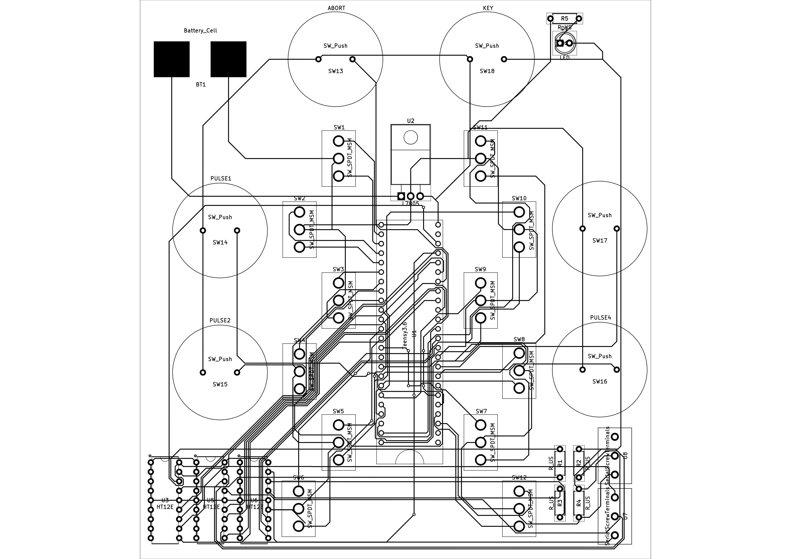

**Launchbox**[^1] is used as a manual override for valve actuation on [**TSPCB**](TestStandPCB), with signals transferred over a direct ethernet connection. It will be further developed to perform aborts and ignition.

## Switches
There are 12 SPDT switches, each with 3 states: High, Low, Neutral. When a switch flipped to HIGH or LOW, it sends a signal to one of two unique digital read pins on the Teensy3.6 which in turn outputs a 3.3V signal from a corresponding digital out pin over ethernet to **TSPCB** to actuate a corresponding valve. 
[^1]: Last updated 2/3/21 @ 21:22