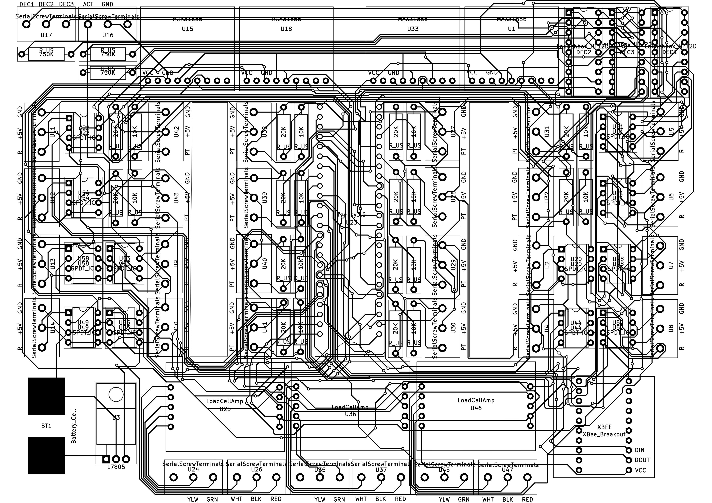

Test Stand PCB[^1], also known as CaelusPCB, TSPCB, or Flight Hardware is controlled by a teensy3.6. The PCB allows the teensy to read data from sensors and actuate valves, which are controlled by [**Flight Software**](..\docs\programming\fs\overview.mdx).

[^1]: Last updated 2/4/21 @ 19:44