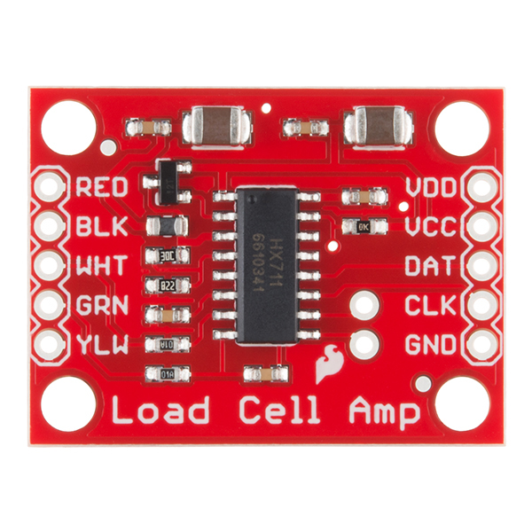

Each load cell has 5 wires that need to be screwed into screw terminals that connect to the Load Cell Amplifier.
:::caution
Load Cell Amplifiers need to be plugged in from the back of TSPCB. GND should be on the top right. Colors may be reversed!
:::

