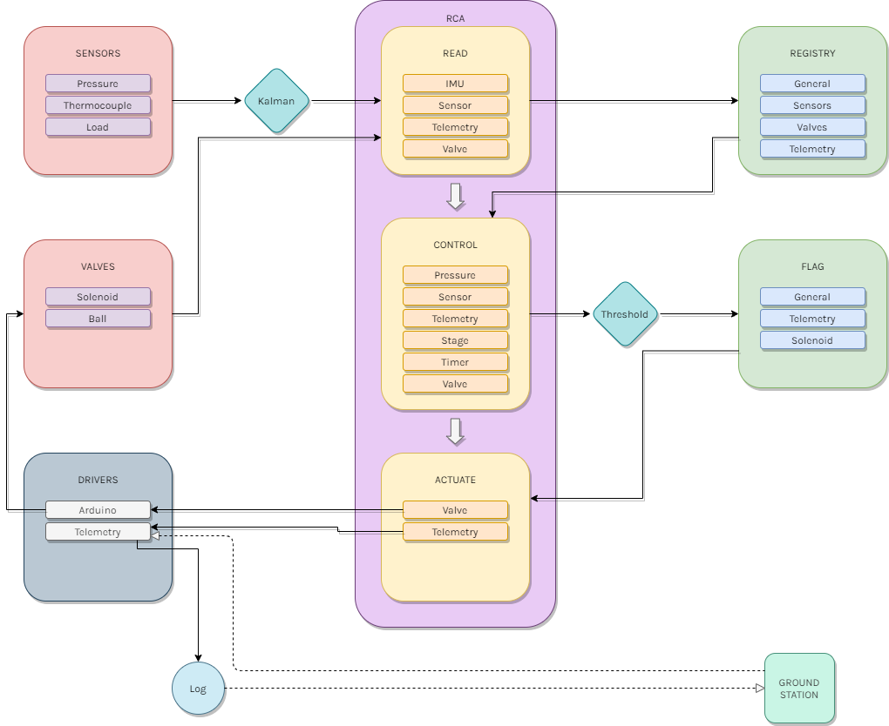

Project Caelus's programming team has split their work into two parts: **Flight Software (FS)** and 
**Ground Station (GS).** The Flight Software reads and monitors sensor data from thermocouples, pressure 
sensors, and load sensors, respondes to potential dangers by actuating values, and sends updates to Ground 
Station. Ground Station takes the data and displays it, and also has override abort systems.

This section gives an overview of our Flight Software. 

## A Brief Outline



Before any code starts, we update our ```config.json``` file. This configuration file outlines what code we 
want to run, the sensors and valves onboard the rocket, and other parameters that might require some flexibility. 

The Flight Software begins by starting the [**Supervisor**](fs_mcl.mdx), an endlessly running loop that overlooks all the code
onboard the rocket. The Supervisor creates the [**Registry**](fs_mcl.mdx), in which we store all our data, and initalizes the 
general [**Control Tasks**](fs_control_tasks.mdx) and detail-oriented [**Tasks**](fs_tasks.mdx). Finally, the Supervisor begins its 
infinite **Read, Control, Actuate (RCA)** loop.

In the first step, Read, the Supervisors gathers data from the Tasks and stores it in the Registry. In the second step, 
Actuate, each Control Task determines if, based on the newly collected data, the rocket needs to take any actions. In the
final step, Actuate, each Task performs the those actions. 

## [Name.hpp](link) and [Name.cpp](link)

Description. 

| ```Constructor()```| 
| :----------- | 
| stuff. |

| Returns     | Description | 
| :---------- | :----------- | 
| ```void```  | ```initalize()``` <br />  words | 
| ```void```  | ```read()```  <br />  are. | 
| ```void```  | ```control()``` <br />   Task. | 
| ```void```  | ```actuate()``` <br />   Task.  | 
| ```void```  | ```run()``` <br />  hard.  | 
