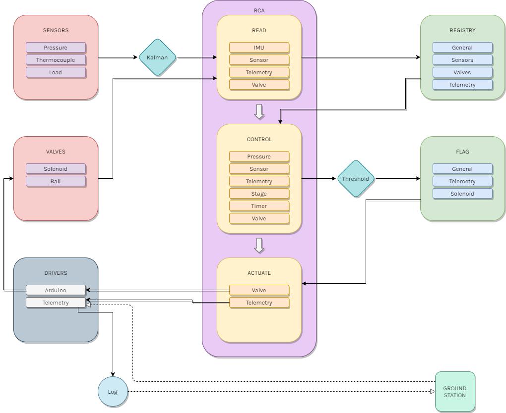

Project Caelus's programming team has split their work into two parts: **Flight Software (FS)** and
**Ground Station (GS).** The Flight Software reads and monitors sensor data from thermocouples, pressure
sensors, and load sensors, respondes to potential dangers by actuating values, and sends updates to Ground
Station. Ground Station takes the data and displays it, and also has override abort systems.

This section gives an overview of our Flight Software.

## A Brief Outline

Before any code starts, we update our `config.json` file. This configuration file outlines what code we
want to run, the sensors and valves onboard the rocket, and other parameters that might require some flexibility.

The Flight Software begins by starting the [**Supervisor**](mcl.mdx), an endlessly running loop that overlooks all the code onboard the rocket. The Supervisor creates the [**Registry**](mcl.mdx), in which we store all our data, and the [**Flag**](mcl.mdx), in which we store all pending actions.
Together, the Registry and Flag contain the entire **state** of the our flight software at any given moment. Supervisor also initalizes the general [**Control Tasks**](control-tasks.mdx) and detail-oriented [**Tasks**](tasks.mdx). In general, Tasks process incoming data and perform actions, while ControlTasks define the control logic on the rocket.

After all Tasks and ControlTasks have been initialized, the Supervisor begins its infinite **Read, Control, Actuate (RCA)** loop. In the first step, Read, the Supervisor gathers data from each Task and stores it in the Registry. In the second step, Control, each Control Task determines if, based on the newly collected data, the rocket needs to take any actions. If so, it updates the Flag with any actions that should be performed. In the final step, Actuate, each Task checks the Flag for pending actions and performs those actions.

## [Name.hpp](link) and [Name.cpp](link)

Description.

| `Constructor()` |
| :-------------- |
| Description     |

| Returns | Method      | Description |
| :------ | :---------- | :---------- |
| `void`  | `method1()` | Description |
| `void`  | `method2()` | Description |
